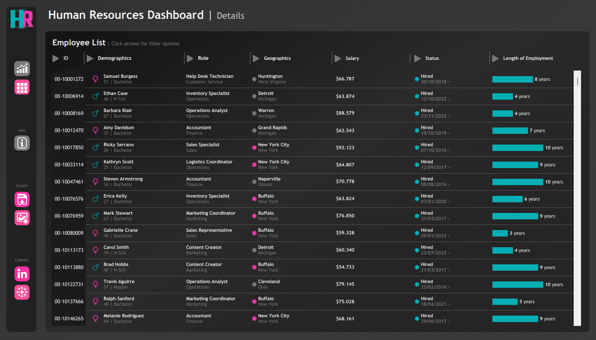

# 👥 Tableau HR Analytics Dashboard Project

## 📌 Project Overview
This project presents an interactive **Human Resources Analytics Dashboard** designed to help HR teams monitor workforce metrics, understand employee demographics, and analyse compensation patterns.

The dashboard provides both a **high-level summary view** for strategic insights and a **detailed employee records view** for operational analysis, enabling data-driven HR decision-making.

🔗 **Interactive Dashboard:** *(add your Tableau Public link here)*

---

## 🧩 Business Problem
HR teams often manage large volumes of employee data across departments, locations, and roles. Without structured visual analysis, it becomes difficult to identify workforce trends, monitor employee lifecycle metrics, and evaluate compensation fairness.

This project transforms raw employee data into an interactive dashboard that helps:

- Monitor hiring and termination trends  
- Understand workforce composition  
- Analyse salary patterns  
- Identify demographic insights  
- Support strategic HR planning  

---

## 📂 Dataset
- **Source:** Employee dataset (CSV)
- **Records:** Employee-level data including demographics, job information, and salary  

---

## 🛠️ Tools Used
- **Tableau Public** – Data visualisation  
- **CSV** – Data source  
- **Basic data preparation** inside Tableau  

---

# 🟦 HR Summary Dashboard | Requirements

## 🎯 Dashboard Purpose
The Summary Dashboard provides a high-level overview of workforce metrics across three main sections: Overview, Demographics, and Income Analysis.

---

## 📌 Overview Section

- Display total number of:
  - Hired employees  
  - Active employees  
  - Terminated employees  

- Visualise hiring and termination trends over time  
- Breakdown employees by department and job title  
- Compare employees between Headquarters (New York) and branches  
- Show geographic distribution by state and city  

---

## 📌 Demographics Section

- Gender ratio across the company  
- Distribution of employees by age group and education level  
- Total employees per age group  
- Total employees per education level  
- Relationship between education background and performance rating  

---

## 📌 Income Analysis Section

- Compare salaries across education levels by gender  
- Analyse correlation between age and salary across departments  

---

# 🟩 Employee Records Dashboard | Requirements

## 🎯 Dashboard Purpose
The Employee Records Dashboard provides detailed employee-level data for operational analysis and reporting.

---

## 📌 Key Features

- Comprehensive employee table including:
  - Name  
  - Department  
  - Position  
  - Gender  
  - Age  
  - Education  
  - Salary  

- Interactive filtering across all available fields  

---

# ⚙️ Design & Interactivity Requirements

## 🔄 Dashboard Dynamics
- Easy navigation between Summary and Detail views  
- Interactive charts enabling visual filtering  
- Responsive layout using container-based design  

## 🎛️ Filters
Users can filter data dynamically across multiple attributes such as department, location, education, and demographics.

---

## 🔍 Key Insights *(Update after analysis)*

- Workforce distribution varies across departments with certain functions dominating headcount.
- Salary differences observed across education levels and age groups suggest experience-based compensation patterns.
- Hiring trends indicate periods of growth followed by stabilization phases.

---

## 💡 Business Recommendations *(Update after analysis)*

- Monitor departments with high turnover to identify retention risks.
- Ensure compensation fairness across gender and education groups.
- Use demographic insights to support workforce planning and diversity initiatives.

---

## 🖼️ Dashboard Preview

### Overview Dashboard

### Details Dashboard

---

## 📂 Repository Structure
tableau-hr-dashboard-projects/
│
├── datasets/ # Raw employee dataset
│ └── employees.csv
│
├── documents/ # Dashboard files & mockups
│ ├── HR Dashboard.twbx
│ ├── mockup-overview-dashboard.png
│ ├── mockup-detail-dashboard.png
│ ├── overwiew-dashboard-preview.png
│ └── details-dashboard-preview.png
│
├── images/ # Dashboard assets & icons
│
├── LICENSE
└── README.md

---
##👋 About Me

Hi there! I'm Novia Noer Ramdiany. I’m passionate about data analytics and transforming complex datasets into clear, actionable insights.

Let’s connect:
🔗 https://www.linkedin.com/in/noviaramdiany/

⭐ If you find this project interesting, feel free to explore and reach out!
